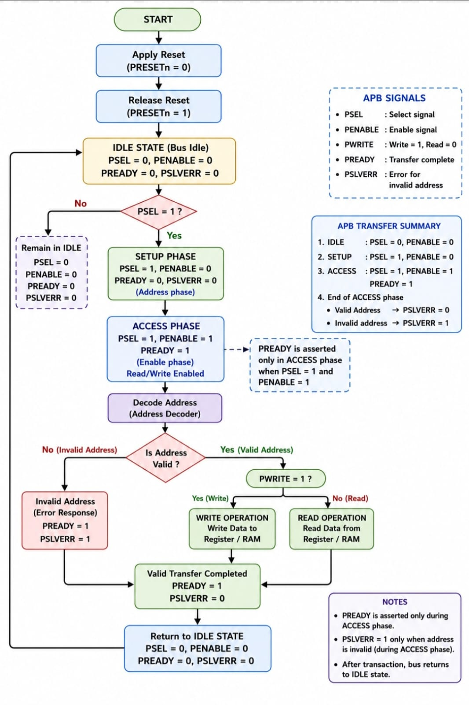
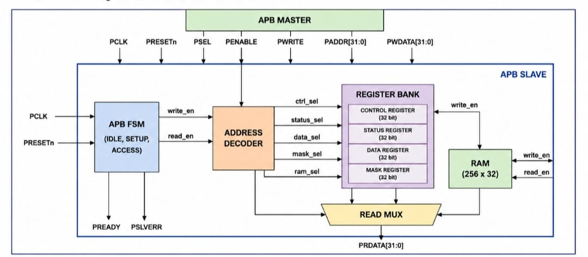
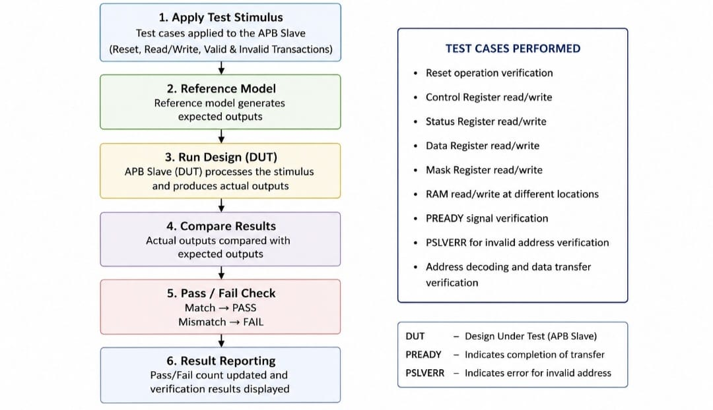
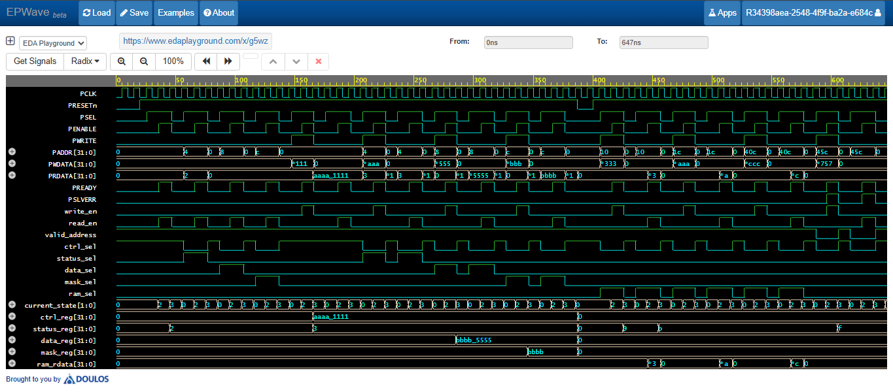

# 🚀 AMBA APB Slave Design and Verification using Verilog HDL

A complete implementation of an **AMBA APB (Advanced Peripheral Bus) Slave** designed from scratch in **Verilog HDL** as part of my **VLSI Frontend Digital Design Internship**.

This project focuses on designing a synthesizable APB Slave using a modular RTL architecture and verifying its functionality through a self-checking testbench with a behavioral reference (Golden) model. The design implements APB-compliant read and write transactions, memory-mapped registers, RAM access, address decoding, and protocol control using a finite state machine (FSM).

---

## ⭐ Project Highlights

- ✔️ AMBA APB Slave implemented in Verilog HDL
- ✔️ Modular RTL architecture
- ✔️ Self-checking verification environment
- ✔️ Behavioral Reference (Golden) Model
- ✔️ Memory-mapped register bank and 256 × 32-bit RAM
- ✔️ APB FSM implementing IDLE, SETUP, and ACCESS states
- ✔️ Address Decoder with register and RAM selection
- ✔️ Automatic `PREADY` and `PSLVERR` generation
- ✔️ Comprehensive APB read/write transaction verification

---

# 📖 Project Overview

The Advanced Peripheral Bus (APB) is part of the ARM Advanced Microcontroller Bus Architecture (AMBA) and is widely used for connecting low-bandwidth peripherals such as GPIO, UART, Timers, SPI, and I²C controllers.

In this project, a complete APB Slave has been developed using Verilog HDL. The design consists of separate RTL modules for protocol control, address decoding, register management, memory access, and data selection, which are integrated into a top-level APB Slave.

To ensure functional correctness, the design is verified using a structured self-checking testbench that employs reusable tasks, a behavioral reference model, automatic output comparison, and comprehensive test scenarios covering both valid and invalid APB transactions.

---

# 🎯 Project Objectives

- Understand the AMBA APB protocol and transaction flow.
- Design a modular and synthesizable APB Slave using Verilog HDL.
- Implement an FSM-based APB controller.
- Develop memory-mapped registers and RAM access.
- Perform address decoding for register and memory selection.
- Verify the design using a self-checking testbench with a behavioral reference model.
- Demonstrate practical RTL design and functional verification techniques using Verilog HDL.

---

# ⚙️ APB Slave Specifications

| Feature | Specification |
|---------|---------------|
| Bus Protocol | AMBA APB |
| Data Width | 32-bit |
| Address Width | 32-bit |
| Control FSM | 3-State (IDLE, SETUP, ACCESS) |
| Register Bank | 4 × 32-bit Registers |
| RAM | 256 × 32-bit |
| Register Addresses | 0x00, 0x04, 0x08, 0x0C |
| RAM Address Range | 0x10 – 0x40C (Word Aligned) |
| Read Operation | Supported |
| Write Operation | Supported |
| Address Decoder | Memory-Mapped |
| PREADY Generation | During ACCESS State |
| PSLVERR Generation | Invalid Address Access |
| Reset Type | Active-Low Asynchronous Reset (PRESETn) |
| RTL Style | Modular Design |

---

# 🏗️ AMBA APB Protocol Overview

<p align="center">
  
</p>

<p align="center">
  <em>APB Protocol State Machine and Transaction Flow</em>
</p>

The Advanced Peripheral Bus (APB) is part of the ARM Advanced Microcontroller Bus Architecture (AMBA) and is specifically designed for communication with low-bandwidth, low-power peripherals. It provides a simple and efficient interface between an APB Master and APB Slave using dedicated address, data, and control signals.

The APB protocol follows a three-state finite state machine (FSM):

```text
        IDLE
          │
          ▼
       SETUP
          │
          ▼
       ACCESS
          │
          ├────────► IDLE
          │
          └────────► SETUP
```

### 💤 IDLE State
- Default state after reset.
- Waits for the master to initiate a transfer.
- No read or write operation is performed.

### ⚙️ SETUP State
- The APB Master selects the slave by asserting **PSEL**.
- Address (`PADDR`), write data (`PWDATA`), and control signals become valid.
- **PENABLE** remains LOW during this state.

### 📤 ACCESS State
- **PENABLE** is asserted HIGH.
- Read or write operation is executed.
- The slave asserts **PREADY** to indicate completion.
- **PRDATA** is driven during read transactions.
- **PSLVERR** is asserted for invalid address accesses.

---

# ⚡ APB Interface Signals

| Signal | Direction | Description |
|---------|-----------|-------------|
| PCLK | Input | APB Clock |
| PRESETn | Input | Active-Low Reset |
| PSEL | Input | Slave Select |
| PENABLE | Input | Access Phase Indicator |
| PWRITE | Input | Write Control Signal |
| PADDR | Input | Address Bus |
| PWDATA | Input | Write Data Bus |
| PRDATA | Output | Read Data Bus |
| PREADY | Output | Transfer Completion Signal |
| PSLVERR | Output | Error Response Signal |

---

# 🏛️ RTL Architecture

<p align="center">
  
</p>

<p align="center">
  <em>RTL Architecture of the AMBA APB Slave</em>
</p>

The APB Slave is designed using a modular RTL architecture, where each module performs a dedicated function. This modular approach improves readability, simplifies verification, and allows individual modules to be developed and tested independently before system-level integration.

The top-level module (`apb_slave_top.v`) connects all internal modules and manages the communication between the APB interface and the internal register bank and RAM.

The architecture consists of the following RTL modules:

---

## 📌 APB Slave Top (`apb_slave_top.v`)

The top-level module integrates all APB Slave components and provides the interface between the APB Master and the internal hardware modules.

### Responsibilities

- Connects all RTL modules
- Interfaces with APB signals
- Generates valid address detection
- Generates the PSLVERR signal for invalid accesses
- Controls overall data flow between modules

---

## 📌 APB FSM (`apb_fsm.v`)

The APB Finite State Machine controls the protocol operation using three states:

- IDLE
- SETUP
- ACCESS

### Responsibilities

- Controls APB transaction flow
- Generates `write_en` signal for write transactions
- Generates `read_en` signal for read transactions
- Generates the `PREADY` signal during the ACCESS state

---

## 📌 Address Decoder (`apb_addr_decoder.v`)

The address decoder monitors the incoming APB address and selects the corresponding register or RAM location.

### Responsibilities

- Decodes memory-mapped addresses
- Selects Control Register
- Selects Status Register
- Selects Data Register
- Selects Mask Register
- Selects RAM for valid memory addresses
- Supports only word-aligned RAM accesses

---

## 📌 Register Bank (`apb_register_bank.v`)

The register bank stores configuration, status, and user data required by the APB Slave.

### Implemented Registers

- Control Register
- Status Register
- Data Register
- Mask Register

The Status Register automatically updates to indicate:

- Successful write operation
- Successful read operation
- Invalid address error
- RAM access

---

## 📌 APB RAM (`apb_ram.v`)

A 256 × 32-bit memory is implemented to support APB memory transactions.

### Features

- Synchronous write operation
- Combinational read operation
- Word-aligned addressing
- Memory-mapped interface

---

## 📌 Read Multiplexer (`apb_read_mux.v`)

The Read Multiplexer selects the appropriate data source during APB read transactions.

Depending on the decoded address, it forwards one of the following to the APB Master:

- Control Register
- Status Register
- Data Register
- Mask Register
- RAM Data

---

## 🔄 Overall Data Flow

During an APB transaction:

1. The APB FSM controls the protocol sequence.
2. The Address Decoder identifies the target register or RAM location.
3. Write operations update the selected register or RAM.
4. Read operations retrieve data through the Read Multiplexer.
5. Invalid addresses generate the `PSLVERR` signal.
6. `PREADY` indicates successful completion of the transaction.

---

# 📋 Register Map

The APB Slave implements four memory-mapped 32-bit registers for configuration, status monitoring, and data storage. These registers are accessed through fixed APB addresses.

| Address | Register | Reset Value | Description |
|---------|----------|-------------|-------------|
| `0x0000_0000` | Control Register | `0x00000000` | Stores control information written by the APB Master. |
| `0x0000_0004` | Status Register | `0x00000000` | Records the status of APB transactions and error conditions. |
| `0x0000_0008` | Data Register | `0x00000000` | Stores user data for read and write operations. |
| `0x0000_000C` | Mask Register | `0x00000000` | Stores only the lower 16 bits of the written data. |

The address range from **0x0000_0010** to **0x0000_040C** is allocated to a **256 × 32-bit RAM**. Only word-aligned addresses are considered valid for RAM accesses.

---

## 📌 Control Register

The Control Register is a 32-bit read/write register used to store control information provided by the APB Master.

- Read/Write accessible
- Reset value: `0x00000000`

---

## 📌 Status Register

The Status Register is automatically updated by the hardware to indicate the outcome of APB transactions.

| Bit | Name | Description |
|-----|------|-------------|
| 0 | Write Complete | Set after a successful write transaction. |
| 1 | Read Complete | Set after a successful read transaction. |
| 2 | Error Flag | Set when an invalid address access occurs (`PSLVERR`). |
| 3 | RAM Access | Set whenever a valid RAM read or write is performed. |
| 31:4 | Reserved | Reserved for future use. |

---

## 📌 Data Register

The Data Register stores general-purpose 32-bit data exchanged between the APB Master and the APB Slave.

- Read/Write accessible
- Reset value: `0x00000000`

---

## 📌 Mask Register

The Mask Register stores only the lower 16 bits of the input write data.

```
mask_reg <= {16'h0000, PWDATA[15:0]};
```

This implementation ensures that the upper 16 bits remain cleared while preserving the lower 16-bit mask value.

---

## 📌 RAM Memory Map

The APB Slave also includes an internal **256 × 32-bit RAM** for data storage.

### Features

- Memory-mapped interface
- Synchronous write operation
- Combinational read operation
- Word-aligned addressing
- Address Range:
  - Start: `0x0000_0010`
  - End: `0x0000_040C`

Any address outside the valid register or RAM range results in the assertion of the **PSLVERR** signal.

---

# ✨ Key Features

The implemented APB Slave provides the following features:

- Fully synthesizable RTL design using Verilog HDL.
- Modular architecture with independently developed RTL modules.
- 32-bit APB interface supporting memory-mapped communication.
- Three-state APB FSM implementing the IDLE, SETUP, and ACCESS states.
- Separate Address Decoder for register and RAM selection.
- Four 32-bit memory-mapped registers:
  - Control Register
  - Status Register
  - Data Register
  - Mask Register
- 256 × 32-bit internal RAM for data storage.
- Support for both APB Read and Write transactions.
- Word-aligned RAM addressing for valid memory accesses.
- Automatic generation of `write_en` and `read_en` control signals.
- Automatic `PREADY` generation during the ACCESS state.
- `PSLVERR` generation for invalid address accesses.
- Hardware-updated Status Register indicating:
  - Write completion
  - Read completion
  - Error detection
  - RAM access
- Partial write implementation for the Mask Register (lower 16 bits only).
- Active-low asynchronous reset (`PRESETn`).
- Memory-mapped architecture with clearly defined register and RAM address spaces.
- Top-level integration of all RTL modules into a complete APB Slave subsystem.

---

# 🧪 Verification Methodology

<p align="center">
  
</p>

<p align="center">
  <em>Self-Checking Verification Flow Using a Behavioral Reference (Golden) Model</em>
</p>

To ensure the functional correctness of the APB Slave, a comprehensive self-checking verification environment was developed in Verilog HDL.

Instead of relying only on waveform inspection, the verification process automatically compares the Design Under Test (DUT) against a behavioral reference (Golden) model, enabling efficient detection of mismatches.

### Verification Environment

The testbench includes:

- Self-checking verification methodology
- Behavioral Reference (Golden) Model
- Reusable APB Read and Write tasks
- Automatic expected output generation
- Automatic DUT vs Reference Model comparison
- Pass/Fail counter for simulation results
- Detailed simulation logging
- Waveform generation using VCD (`$dumpfile` and `$dumpvars`)

This approach improves verification efficiency and minimizes manual debugging.

---

# ✅ Test Scenarios

The following functional test scenarios were verified during simulation.

| Test Scenario | Description |
|--------------|-------------|
| Reset Verification | Verified correct reset values for all registers. |
| Control Register | Verified write and read operations. |
| Status Register | Verified automatic hardware status updates. |
| Data Register | Verified read and write functionality. |
| Mask Register | Verified storage of only the lower 16 bits. |
| RAM Write | Verified writing data into internal RAM. |
| RAM Read | Verified reading data from internal RAM. |
| Invalid Address Access | Verified assertion of the `PSLVERR` signal. |
| Word-Aligned RAM Access | Verified valid RAM address decoding. |
| APB Read Transactions | Verified complete APB read protocol. |
| APB Write Transactions | Verified complete APB write protocol. |

---

# 📊 Verification Summary

The testbench automatically compares the DUT outputs with the expected outputs generated by the behavioral reference model.

The following outputs are verified during every APB transaction:

- `PRDATA`
- `PREADY`
- `PSLVERR`

Simulation results are categorized as **PASS** or **FAIL**, and the overall verification summary is displayed at the end of simulation using pass and fail counters.

This automated verification methodology helps ensure that the APB Slave operates correctly for both valid and invalid transaction scenarios.

---

# 🌊 Simulation Results

<p align="center">
  
</p>

<p align="center">
  <em>EPWave Simulation Showing APB Read/Write Transactions and Signal Activity</em>
</p>

The APB Slave was simulated using **EDA Playground** with the **Icarus Verilog** simulator. Functional verification was performed using a self-checking testbench, and simulation waveforms were analyzed using **EPWave**.

A representative simulation waveforms demonstrating APB transactions is included in the **waveform/** directory.

### Simulated Operations

- APB Reset Sequence
- Register Write Transaction
- Register Read Transaction
- RAM Write Transaction
- RAM Read Transaction
- Invalid Address Access
- PSLVERR Assertion
- PREADY Generation
- FSM State Transitions

---

# 📂 Repository Structure

```text
amba-apb-slave-verilog/
├── README.md
├── images/
│   ├── apb_block_diagram.png
│   ├── apb_protocol_flow.png
│   ├── architecture_reference.png
│   └── verification_flow.png
├── rtl/
│   ├── README.md
│   ├── apb_slave_top.v
│   ├── apb_fsm.v
│   ├── apb_addr_decoder.v
│   ├── apb_register_bank.v
│   ├── apb_ram.v
│   └── apb_read_mux.v
├── tb/
│   ├── README.md
│   └── apb_slave_tb.v
└── waveform/
    └── apb_simulation_waveform.png

```

---

# 🛠️ Tools Used

- Verilog HDL
- EDA Playground
- Icarus Verilog
- EPWave
- GitHub

---

# 🚀 Future Improvements

The current implementation provides a functional APB Slave suitable for learning RTL design and verification concepts. Future enhancements may include:

- Wait-state implementation
- Interrupt generation support
- Configurable register bank
- Additional peripheral modules such as GPIO, UART, SPI, or Timer
- Functional coverage and assertion-based verification using SystemVerilog
- UVM-based verification environment
- Burst transfer support (through higher-performance AMBA protocols)

---

# 👩‍💻 Author

**Pooja Bhavsar**

Electronics and Communication Engineering Student

Aspiring VLSI RTL Design and Functional Verification Engineer

Passionate about Digital Design, Verilog HDL, RTL Design, and Functional Verification.

---

# 🙏 Acknowledgement

This project was developed during my **VLSI Frontend Digital Design Internship** as part of my learning journey in RTL Design and Functional Verification.

I sincerely thank my mentors for their valuable guidance, continuous support, and encouragement throughout the internship. Their mentorship helped me strengthen my understanding of Verilog HDL, digital design concepts, and verification methodologies.


